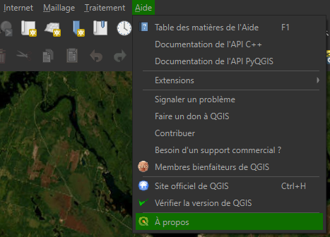
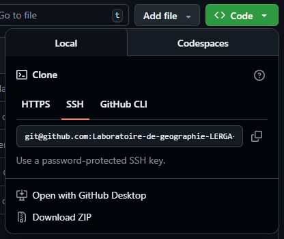
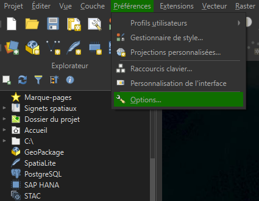
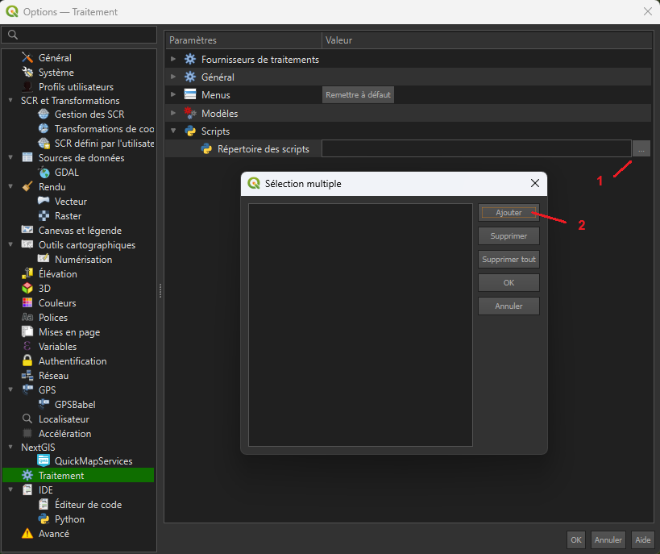
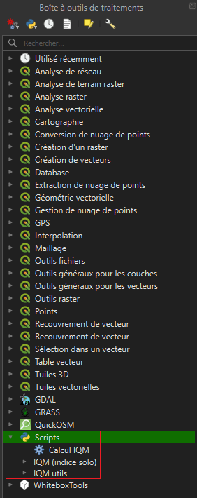
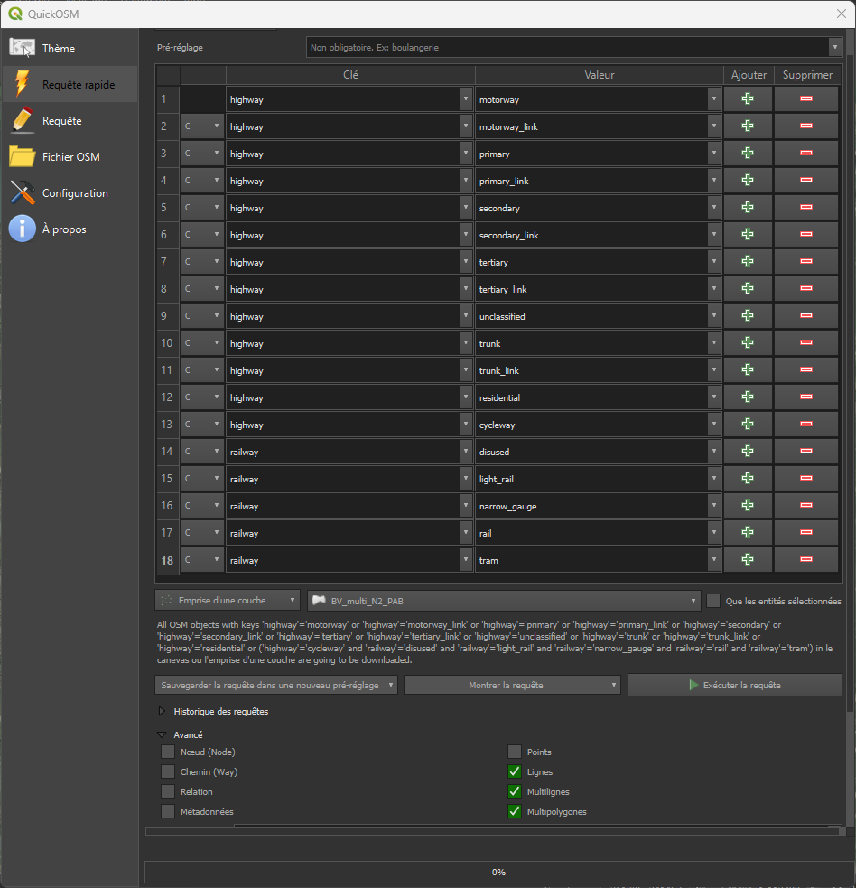
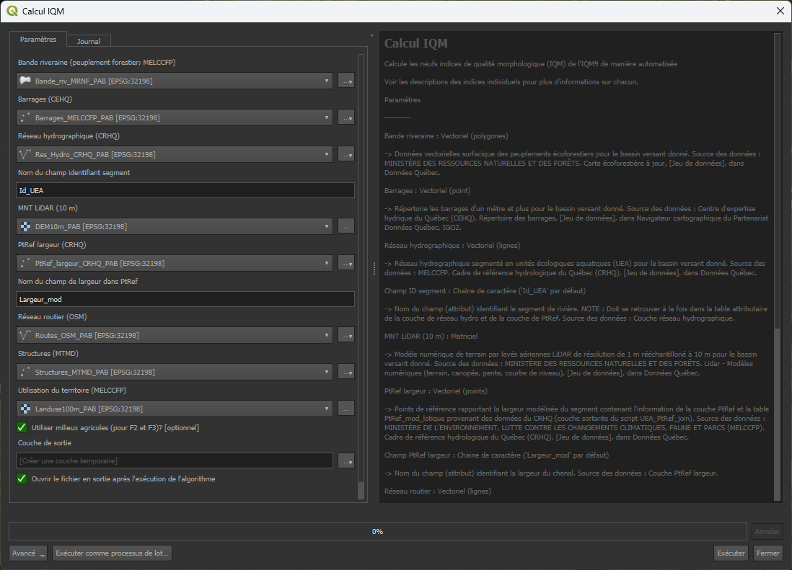
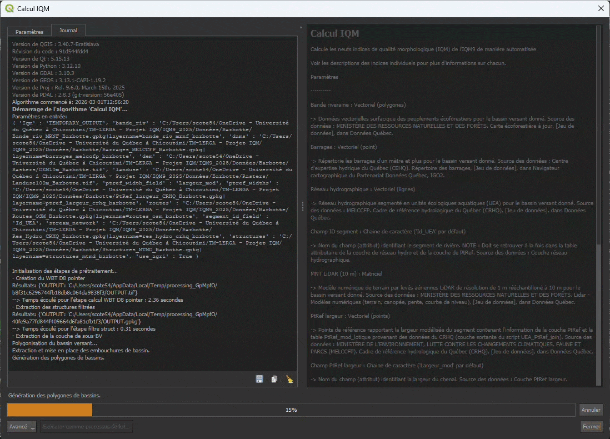

# Outil automatisé de calcul de l'indice de qualité morphologique à neuf indices (IQM9*)

> Veuillez prendre note que l'outil est toujours ***en phase de développement actif*** ! Assurez-vous d'avoir la dernière version à jour de [la branche main du dépôt](https://github.com/Laboratoire-de-geographie-LERGA-UQAC/QGIS-IQM9/tree/main) avant de le tester et de sélectionner l'option _Surveiller le dépôt_ pour être informé du développement de l'outil

## Table des matières

- [À propos](#à-propos)
- [Installation](#installation)
  - [Prérequis et dépendances](#prérequis-et-dépendances)
  - [Intégration de l’outil à QGIS](#intégration-de-loutil-à-qgis)
- [Préparation des données](#préparation-des-données)
  - [Origine et nature des données nécessaires pour l'utilisation de l'outil IQM9*](#tableau-1-origine-et-nature-des-données-nécessaires-pour-lutilisation-de-loutil-iqm9)
  - [Données vectorielles](#données-vectorielles)
  - [Données matricielles](#données-matricielles)
- [Utilisation de l'outil](#utilisation-de-loutil)
- [Standards suivis](#standards-suivis)
- [Commentaires et contributions](#commentaires-et-contributions)
- [Licence](#licence)
- [Remerciements](#remerciements)

## À propos
L'outil automatisé de calcul de l'indice de qualité morphologique à neuf indices (IQM9*), développé pour [le logiciel QGIS](https://qgis.org/), se veut une méthode alternative, automatisée et efficiente à l'application de l'IQM à vingt-huit indices dans le but de caractériser la dégradation anthropique des cours d'eau.

L'IQM9* a été développé avec les objectifs suivants :
- Tirer parti de la disponibilité des **données géospatiales ouvertes**;
- **Réduire la charge de travail** nécessaire pour calculer l'IQM des cours d'eau;
- Offrir une **alternative représentative, minimaliste et performante** de l'IQM à vingt-huit indices;
- Proposer une **interface facile à intégrer et à utiliser** dans QGIS; 
- Présenter un outil **adapté à la réalité hydrographique du territoire Québécois**. 

## Installation

### Prérequis et dépendances
#### QGIS
---
QGIS est un logiciel libre et *open source* de système d'information géographique (SIG) qui est utilisé pour visualiser, éditer et analyser des données géospatiales.

Avant de pouvoir utiliser l'outil, vous devez installer QGIS et ses dépendances :
- Téléchargez la dernière version stable de QGIS (***QGIS 3.40-Bratislava***) [depuis le site officiel](https://www.qgis.org/fr/site/forusers/download.html);
  > L'outil **a seulement été testé pour QGIS 3.40** jusqu'à présent. Il sera prochainement testé sur des versions plus récentes.
- Suivez les instructions d'installation pour votre système d'exploitation (Windows, macOS, Linux);
- Après l'installation, assurez-vous que les bibliothèques GDAL, GEOS, PROJ et SQLite soient installées avec QGIS (devrait être fait automatiquement avec l'installation de QGIS) en passant par l'onglet Aide > À propos.

  

#### WhiteBoxTools
---
WhiteboxTools est une bibliothèque de logiciels de géotraitement à code source ouvert, qui est utilisée pour effectuer une variété de tâches d'analyse spatiale et de traitement de données géospatiales. Cette bibliothèque offre une vaste gamme d'algorithmes pour le traitement des données matricielles et vectorielles.
L'outil nécessite une version à jour de Whiteboxtools. Pour cela, il est nécessaire d'intégrer cette boîte à outils à QGIS en suivant [les instructions d'installation sur le site officiel](https://www.whiteboxgeo.com/manual/wbt_book/qgis_plugin.html), et en installant [l'extension QGIS de WhiteboxTools](https://plugins.qgis.org/plugins/wbt_for_qgis/) (la page de l'extension décrit davantage comment lier les fichiers binaires et l'extension).

#### QuickOSM
---
[QuickOSM est une extension pour QGIS](https://plugins.qgis.org/plugins/QuickOSM/) qui permet d'extraire des géométries provenant d'OpenStreetMap directement dans le logiciel QGIS. Cette extension est particulièrement utile pour extraire des entités sur une grande surface. L'extension peut être installée directement dans l'interface QGIS (voir [la documentation QGIS sur l'installation des extensions](https://docs.qgis.org/3.40/fr/docs/training_manual/qgis_plugins/fetching_plugins.html)).

#### Autres outils utiles (optionnel)

Si vous envisagez d'appliquer des modifications aux scripts, nous vous recommandons fortement d'installer l'extension [*Plugin Reloader*](https://plugins.qgis.org/plugins/plugin_reloader/). Elle vous permettra de recharger les scripts après modification plutôt que de fermer et rouvrir QGIS à chaque fois. Pour ce faire, sélectionnez l'option `processing` dans le menu déroulant de l'extension pour recharger les scripts IQM9*. Il peut être installé via le [gestionnaire d'extensions intégré à QGIS](https://docs.qgis.org/3.40/en/docs/training_manual/qgis_plugins/fetching_plugins.html).

Pour vous aider à mieux comprendre les résultats de l'outil, il peut être utile d'utiliser un fond de carte d'images satellitaire (p. ex. pour observer la présence de milieux urbains, agricoles, etc.). [L'extension QGIS QuickMapServices](https://plugins.qgis.org/plugins/quick_map_services/#plugin-details) permet de télécharger des fonds de cartes diverses (images satellites, cartes topo, etc.) tirées de différents sources (ESRI, Google, OSM, etc.) directement dans QGIS.

 > La qualité des images varie d'une source et d'un endroit à l'autre. Si vous avez besoin d'images de plus haute résolution, nous vous recommandons plutôt d'utiliser des images provenant de l'[imagerie continue du gouvernement du Québec](https://mrnf.gouv.qc.ca/repertoire-geographique/vue-aerienne-quebec-imagerie-continue/) ou celles des [mosaïques d'orthophotographies aériennes de l'inventaire écoforestier du Québec](https://www.donneesquebec.ca/recherche/dataset/mosaique) (pour le territoire québécois)

### Intégration de l’outil à QGIS
Pour intégrer l'outil à QGIS, vous devez télécharger les scripts fournis puis ajoutés à la *Boîte à outils de traitement* de QGIS (voir [la documentation QGIS à ce sujet](https://docs.qgis.org/3.40/fr/docs/user_manual/processing/toolbox.html)).
Les scripts sont disponibles dans le [dépôt GitHub,](https://github.com/Laboratoire-de-geographie-LERGA-UQAC/QGIS-IQM9) en les clonant ou en les téléchargeant sous format « .zip ».

Une fois téléchargé, l'ajout des scripts à QGIS se fait comme suit :
- Ouvrez QGIS et cliquez sur l'option *Préférences* dans la barre de menus;
- Sélectionnez *Options* dans le menu déroulant;

- Dans la boîte de dialogue des *Options*, cliquez sur l'onglet *Traitement*, puis sélectionnez l'onglet *Scripts*.
- Cliquez sur l'espace à droite de Répertoire des scripts, puis sur l'encadré à droite (1);
- Dans la nouvelle boîte de dialogue qui apparaît, veuillez cliquer sur le bouton *Ajouter* à droite (2), puis sélectionnez l'emplacement du dossier QGIS-IQM9 que vous avez préalablement téléchargé et décompressé sur votre ordinateur;

- Cliquez sur *OK* pour enregistrer les modifications.

Une fois ajoutés dans le répertoire des scripts, ceux-ci **seront maintenant disponibles dans la *Boîte à outils de traitements* de QGIS** :

[Retour vers le haut](#top)

## Préparation des données
Avant de débuter, il est important de noter que le système de coordonnées de référence (SCR) utilisé pour le projet QGIS ***doit*** **utiliser le mètre comme unité de distance** et que les différentes couches doivent utiliser le même SCR. **Pour l'utilisation sur le territoire québécois**, il est recommandé d'utiliser le système de coordonnées suivant pour assurer la cohérence des données spatiales :

| Système de coordonnées de référence | Code EPSG                           | Unités  |
| :---------------------------------- | :---------------------------------- | :------ |
| NAD83 / Quebec Lambert              | [EPSG:32198](https://epsg.io/32198) | mètres  |

Le calcul de chaque indicateur nécessite différentes données géospatiales tirées de sources gouvernementales et publiques ***qui devront être prétraitées avant d’être fournies à l’outil*** :
#### Tableau 1. Origine et nature des données nécessaires pour l'utilisation de l'outil IQM9*
| Jeux de données (org. responsable)  | Description | Type de données    | Lien hypertexte vers la ressource |
| :-------------------------------- | :------- | :-------- | :------- |
| Bassins hydrographiques multiéchelles du Québec (MELCCFP)  | Délimitation des bassins hydrographiques  | Vectoriel (polygones)  | [Données Québec](https://www.donneesquebec.ca/recherche/fr/dataset/bassins-hydrographiques-multi-echelles-du-quebec)  |
| Cadre de référence hydrologique du Québec (CRHQ) v1.1 (MELCCFP)  | Réseau d’unités écologiques aquatiques (UEA) linéaire (UEA_L_N2) (réseau hydrographique) | Vectoriel (lignes) | [Données Québec](https://www.donneesquebec.ca/recherche/dataset/crhq) |
|          | Points de référence (PtRef) (pour la largeur des UEA)  | Vectoriel (points)  |     |
| Carte écoforestière à jour (MRNF)  | Caractéristiques du territoire forestier (pour la bande riveraine)  | Vectoriel (polygones)  | [Données Québec](https://www.donneesquebec.ca/recherche/fr/dataset/carte-ecoforestiere-avec-perturbations)  |
| Réseau routier (OpenStreetMap)  | Réseau routier, ferroviaire et cyclable  | Vectoriel (lignes)  | [OpenStreetMap](https://www.openstreetmap.org/export)  |
| Structures (MTMD)  | Localisation ponctuelle des structures du MTMD (pont, ponceau, tunnel, etc.)  | Vectoriel (points)  | [Données Québec](https://www.donneesquebec.ca/recherche/dataset/structure)  |
| Répertoire des barrages (MELCCFP)  | Localisation ponctuelle des barrages d’un mètre et plus  | Vectoriel (points)  | [Répertoire des barrages](https://www.cehq.gouv.qc.ca/barrages/default.asp#version-telechargeable)  |
| LiDAR – Modèles numériques (MRNF)  | LiDAR résolution aux 1 m  | Matriciel  | [Forêt ouverte](https://www.foretouverte.gouv.qc.ca/)  |
| Utilisation du territoire (MELCCFP)  | Classes d’utilisation du territoire (forestier, agricole, anthropique, etc.)  | Matriciel  | [Données Québec](https://www.donneesquebec.ca/recherche/fr/dataset/utilisation-du-territoire)  |
Abréviations utilisées : MELCCFP, ministère de l'Environnement, de la Lutte contre les changements climatiques, de la Faune et des Parcs du Québec; MRNF, ministère des Ressources naturelles et des Forêts du Québec; MTMD, ministère des Transports et de la Mobilité durable du Québec. 

Il est également conseillé de minimiser l'emprise des données pour le bassin versant étudié, même si ce n'est pas obligatoire, cela permettra d'alléger les calculs et d'améliorer les performances de l'outil. Vous pouvez réduire l'emprise en sélectionnant uniquement les données pertinentes pour votre étude.
Assurez-vous que toutes les données nécessaires à l'analyse sont présentes et correctement formatées. Les formats de fichiers testés par l'outil incluent les formats vectoriels, tels que les fichiers Shapefile (.shp), les fichiers geopackge (.gpkg), et les formats matriciels tels que GeoTIFF (.tif).

> Dans les sections suivantes, autant que possible, les informations suivantes sont données pour chaque étape de traitement : 
> - Le nom de chaque outil de traitement tel qu'on le retrouve dans la boîte à outils de traitement de QGIS écrit en *italique*;
> - Le nom de l'algorithme correspondant pour utilisation dans la console Python de QGIS (p. ex. *native : buffer*);
> - Le nom des paramètres;
> - Le nom des paramètres tel qu'on les utiliserait dans la console Python écrit en *MAJUSCULES*.
>
> Veuillez consulter [la documentation de QGIS 3.40](https://docs.qgis.org/3.40/fr/docs/index.html) pour plus d'information sur les différents outils utilisés.

### Données vectorielles :
#### Bassins hydrographiques multiéchelle
---
Ce jeu de données regroupe les polygones des différents bassins hydrographiques sur l’ensemble du territoire de la province de Québec divisé en régions hydrographiques. Ces polygones sont utiles pour **délimiter la superficie du bassin** à l’étude et facilitent l’extraction des autres données spatiales. 

Pour obtenir le bassin désiré, il suffit de :
- Trouver le bassin voulu à l’aide de l’attribut *Nom bassin*;
- Sélectionner l’entité;
- Utiliser l’outil de traitement *extraire les entités sélectionnées* (*native : saveselectedfeatures*) avec la couche de délimitation des bassins comme couche source (*INPUT*). 

Il est important de mentionner que les outils de délimitation de bassin de drainage basés sur des données matricielles (comme ceux offerts par *WhiteBoxTools*) peuvent donner des résultats qui diffèrent de la géométrie des bassins de ce jeu de données. Toutefois, dans le but d’avoir une délimitation universelle qui ne varie pas en fonction des données utilisées, ***nous considérons ici ces formes comme étant les limites réelles des bassins versants***.

#### Réseau hydrographique et points de références (CRHQ)
---
La géodatabase du CRHQ contient des données vectorielles linéaires des cours d'eau, qui sont divisés en unités écologiques aquatiques (UEA) et des points de référence contenant des variables descriptives du réseau hydrographique. Pour les obtenir, il suffit de **télécharger les données du CRHQ pour la région hydrographique correspondante au bassin versant** (identifiable à l'aide de l'attribut *No région hydrographique* de la couche de délimitation du bassin versant).

***Réseau hydrographique***

Pour extraire le réseau hydrographique linéaire, il faut :
- Importer la couche **UEA_L_N2**; 
- Utiliser l’outil de traitement *couper* (*native : clip*) en utilisant la couche **UEA_L_N2** comme couche source (*INPUT*) et la couche de délimitation du bassin comme couche de superposition (*OVERLAY*);
- Ajouter un attribut *segment* à la table attributaire qui est la copie du champ fid (soit une série de chiffres unique). 
  > Cette étape ne sera plus nécessaire dans les prochaines versions.

Il est ensuite pertinent de **retirer les morceaux de segments orphelins résultant de la coupe** (c.-à-d. un segment dont la majorité est à l’extérieur de la délimitation du bassin, mais dont l’emprise intersecte avec elle). Ce genre de segments sont plus prévalents en bordure du bassin. Si toutefois la majorité du segment coupé est situé **à l’intérieur du bassin**, il faut s’assurer que l’objet appartient au bassin versant et qu’il est connecté. On peut utiliser l’attribut *Id_UEA_aval* pour vérifier si le segment d’aval est situé à l’intérieur du bassin versant (donc que le cours d’eau s’écoule vers le bassin) et qu'il est relié au bassin. Si c’est le cas, on laisse le segment dans le réseau du bassin, autrement on le retire ainsi que les autres segments non connectés.

***Points de référence***

Après avoir isolé le réseau hydrographique du bassin, il faut extraire les points de référence de la manière suivante :
- Importer l’objet vectoriel (points) PtRef ainsi que la table PtRef_Mod_Lotique (les autres tables ne sont pas utilisées);
- Utiliser l’outil *extraire par localisation* (*native : extractbylocation*) avec la couche PtRef comme couche d’extraction (*INPUT*), la couche de délimitation du bassin comme couche de comparaison (*INTERSECT*) et en choisissant est à l’intérieur comme prédicat géométrique (*PREDICATE*); 
- Lancer le script utilitaire (IQM utils) *UEA_PtRef_join* de l’outil IQM9* avec la couche PtRef liée au bassin, la table PtRef_Mod_Lotique et le réseau hydrologique linéaire du bassin comme entrées.
  > Ce script joint l’attribut de largeur modélisée de l’UEA (*Largeur_mod*) de la table PtRef_Mod_Lotique et retire les points pour lesquels la validité de l’information compilée au niveau des points de référence n'est pas valide (attribut *Valide_bv* = 0)

#### Carte écoforestière (bande riveraine)
---
Pour obtenir les données des cartes écoforestières, il faut d’abord** identifier les feuillets 1/250 000 qui font partie de la délimitation du bassin versant**. Sur la page du jeu de données de Données Québec, vous pouvez télécharger et importer le fichier GeoJSON nommé «Liens de téléchargement par feuillet 1/250 000 (aperçu des feuillets)» (*URL_250K_MAJ*) pour vous aider à trouver les liens de téléchargement correspondant aux feuillets désirés. 

Une fois les fichiers *GeoPackage* (GPKG) de feuillets téléchargés, on procède au prétraitement de ces couches de la manière suivante :
- Importer la couche vectorielle (polygones) pee_maj_<*feuillet 250k du BV*>;
- Sélectionner les polygones pour qui l’attribut *type_couv* (correspondant aux grands types de couvert du peuplement) est soit F (feuillus), R (résineux) ou M (mixte);
  > Puisque nous voulons identifier les zones qui correspondent au couvert forestier
- Extraire les polygones qui satisfont l’exigence à l’aide de l’outil *extraire les entités sélectionnées* (*native : saveselectedfeatures*);
- Créer une zone tampon (outil *tampon*, *native : buffer*) de 100 m (paramètre *distance*, *DISTANCE*) basée sur la couche de délimitation du bassin versant comme couche source (*INPUT*);
  > La zone tampon est nécessaire, puisque certains algorithmes utilisent des transects perpendiculaires au réseau hydrographique qui peuvent dépasser les limites du bassin si le tracé du cours d'eau longe les limites du bassin
- Utiliser l'outil *extraire par localisation* (*native : extractbylocation*) avec les polygones de carte écoforestière comme couche d'extraction (*INPUT*) et le tampon de 100 m comme couche de comparaison (*INTERSECT*) en utilisant le paramètre *intersecte* comme paramètre de prédicat géométrique (*PREDICATE*).

Dans le cas où un bassin versant s’étend sur plusieurs feuillets, chaque feuillet est préparé de la même façon que décrit précédemment (pour le type de couverture, puis extrait par localisation individuellement sur la surface du tampon de 100 m). Ils sont ensuite fusionnés en une seule couche en utilisant l’outil de traitement *fusionner des couches vecteur* (*native : mergevectorlayers*) avec toutes les couches de chaque feuillet préalablement traitées comme couches en entrée (*LAYERS*).

#### Réseau routier
---
Pour extraire le réseau routier, nous recommandons d’utiliser l’extension QGIS QuickOSM ([voir section d'installation de QuickOSM](#quickosm)) qui rend l'extraction de données d'OpenStreetMap sur de grandes surfaces plus facile que sur [le portail web d'extraction d'OSM](https://www.openstreetmap.org/export).

Pour procéder à l'extraction du réseau routier à l'aide de l'extension QuickOSM, il faut : 
1. Ouvrir l'onglet *Requête rapide*;
2. Remplir les champs *Clé* et *Valeur* énumérés dans le tableau ci-bas en choisissant la condition OR dans la colonne à gauche de la colonne *Clé*;

| Clé (descrip.)   | Valeura | Type normes ou OSMb    | Source normes | Demi-emprise (m) | Notes |
| :--------------- | :----------------- | :-------------------------------- | :------------ | :--------------- | :---- |
| Highway (routes) | motorway           | Type A : Autoroute à quatre voies | Ministère des Transports du Québec. (2012, 15 juin). Normes - Ouvrages routiers (13e éd., Tome I - Conception routière) (chap. 5, dessin normalisé 001). Les Publications du Québec. | 22.50 | On considère seulement les autoroutes à quatre voies qui sont ce qui est le plus répandu |
|                  | motorway_link       | Musoirs et bretelles d'autoroute une voie | *Ibidem*, (chap. 9, dessin normalisé 011 et 014) | 4.00 | On prend seulement en compte la largeur de la chaussée (5 m), de l'accotement droit (2 m) et gauche (1 m) |
|                  | primary       | Type B : Route nationale | *Ibid.*, (chap. 5, dessin normalisé 002) | 21.25 |  |
|   | primary_link | Couloir d'îlot déviateur | *Ibid.*, (chap. 8, dessin normalisé 023) | 2.50 | Prends seulement en compte la largeur minimale avec accotement |
|   | secondary | Type C : Route nationale ou régionale | *Ibid.*, (chap. 5, dessin normalisé 003) | 17.50 | |
|   | secondary_link | Couloir d'îlot déviateur | *Ibid.*, (chap. 8, dessin normalisé 023) | 2.50 | Prends seulement en compte la largeur minimale avec accotement |
|   | tertiary | Type D : Route nationale régionale - collectrice ou locale | *Ibid.*, (chap. 5, dessin normalisé 004) | 15.00 | |
|   | tertiary_link | Couloir d'îlot déviateur | *Ibid.*, (chap. 8, dessin normalisé 023) | 2.50 | Prends seulement en compte la largeur minimale avec accotement |
|   | unclassified | Type E : Route régionale - collectrice ou locale | *Ibid.*, (chap. 5, dessin normalisé 005) | 12.50 | |
| |trunk|Type B : Route nationale| *Ibid.*, (chap. 5, dessin normalisé 002) | 21.25 | |
| | trunk_link | Couloir d'îlot déviateur | *Ibid.*, (chap. 8, dessin normalisé 023)| 2.50 | Prends seulement en compte la largeur minimale avec accotement | 
| | residential | Type F : Route collectrice ou locale | *Ibid.*, (chap. 5, dessin normalisé 006) | 10.00 | |
| | cycleway | Voies cyclables | *Ibid.*, (chap. 15, p. 12) | 1.50 | On considère seulement la largeur de la chaussée pour une piste bidirectionnelle avec un débit de circulation cycliste de plus de 1500 |
| Railway (voie ferrée)| disused | Voie ferrée désaffectée | Transport Canada. (2014, 12 mars). Norme relative aux gabarits ferroviaires (TC E-05) (Schéma 1). | 5.486 | On considère la largeur minimale soit dans le cas où il n'y a pas de piste d'entretien |
| | light_rail | Train-tram (tram qui roule sur une voie séparée) | *Ibid.* | 5.486 |
| | narrow_gauge | Voie ferrée étroite (écartement entre les rails inférieur ou égal à 1 m) | *Ibid.* | 5.486 | Au Canada, on ne trouve pas de *narrow gauge* (1435 mm est l’écartement utilisé), mais il est laissé pour des cas où l’outil serait utilisé là où il y en a.
| |rail| Voie ferrée | *Ibid.* | 5.486 | |
| |tram| Ligne de tramway | *Ibid.* | 5.486 | |

aLa description d’OSM de chacune des valeurs est disponible sur les pages du wiki d’OSM pour la [clé highway](https://wiki.openstreetmap.org/wiki/FR:Key : highway) et la [clé railway](https://wiki.openstreetmap.org/wiki/FR:Key : railway). 
bLes routes sont identifiées en fonction de leur équivalent dans les normes de construction routière, tandis que les voies ferrées sont identifiées par les descriptions de clé ferroviaire d’OSM.

3. Sous le tableau de requête, choisir l'option *Emprise d'une couche* et sélectionner la couche correspondant à la délimitation du bassin.
4. Dans le menu *Avancé* sélectionner seulement les options lignes, multilignes et multipolygones;
> Ce qui devrait donner le résultat suivant dans l'interface de QuickOSM :

5. Exécuter la requête;
   > Il est possible de sauvegarder cette requête QuickOSM en cliquant sur *Sauvegarder la requête dans un nouveau pré-réglage* et choisir *Create New* avant d'exécuter la requête. Cela permet de refaire cette requête sur un autre bassin versant (à partir de l’onglet *Thème*) sans avoir à remplir à nouveau les champs *Clé* et *Valeur*

6. Fournir la couche sortante de QuickOSM au script utilitaire (IQM utils) d'*Extraction routes OSM* (en entrées la couche du réseau routier et la couche de délimitation du bassin).
   > Le script utilitaire reprojette la couche dans le SCR du projet, sélectionne seulement les lignes voulues et ajoute la largeur de l’emprise des routes et pistes cyclables basées sur les normes de construction routière du Québec ainsi que celle des chemins ferroviaires basés sur les normes fédérales relatives au gabarit ferroviaire selon les types de routes et chemins de fer (voir le tableau de l'étape 2 pour les normes exactes utilisées)

Pour plutôt utiliser [le portail web d'OSM,](https://www.openstreetmap.org/export) il suffit de :
 - Zoomer sur l'emprise voulue (en zoomant sur la carte);
 - Cliquer sur exporter;
 - Importer dans QGIS la couche linéaire *lines* du fichier map.osm téléchargé;
 - Fournir cette couche au script utilitaire d'*Extraction routes OSM* (en entrées la couche *lines* et la couche de délimitation du bassin).

La résultante est une couche vectorielle de lignes représentant le réseau routier, ferroviaire et cyclable à l’échelle du bassin versant.

#### Structures
---
La couche de structure est obtenue par une simple extraction par localisation à l’aide de l’outil de traitement *extraire par localisation* (*native : extractbylocation*) avec la couche de points des structures comme couche d’extraction (*INPUT*) et la délimitation du bassin comme couche de comparaison (*INTERSECT*) en choisissant *est à l’intérieur* comme prédicat géométrique (*PREDICATE*). 

Dans le cas où l’on voudrait exécuter les scripts des indices individuels, il est possible d’ensuite utiliser le script utilitaire (IQM utils) *Filtrer structures* (en entrées les couches de réseau hydrographique linéaire, de réseau routier et de structures) pour obtenir une combinaison des routes et des structures qui intersectent le réseau hydrographique. **Cette étape est toutefois optionnelle,** puisque les scripts qui utilisent ces données les génèrent automatiquement dans le cas où elles ne sont pas fournies par la personne utilisatrice.

#### Barrages
---
Les points correspondant aux barrages sont extraits à partir de la version téléchargeable du répertoire des barrages (chiffrier Excel de la mise à jour du 2025/10/17, voir [tableau 1](#tableau-1-origine-et-nature-des-données-nécessaires-pour-lutilisation-de-loutil-iqm9)). 

Avant d’importer la table dans QGIS, il incombe d’apporter les modifications suivantes au fichier (dans le logiciel Excel) : 
- Remplacer les accents (accent circonflexe, grave, aigu, etc.) par des lettres sans accentuations; 
  > Cela évite les problèmes reliés à l’encodage du texte qui empêcheraient leur affichage de manière adéquate dans QGIS
- Convertir les virgules en points pour les colonnes *Longitude (NAD83)* et *Latitude (NAD83)*;
- Retirer la première ligne (contenant Identification, Localisation, Hydrographie, etc.) et la dernière ligne dans le bas du tableau (contenant la date de mise à jour);
  > Évite les problèmes de lignes
- Il faut ensuite enregistrer le fichier en format CSV (de l’anglais *Comma-Separated Values*) en utilisant le point-virgule (;) comme séparateur.
  > Utiliser le point-virgule évite les problèmes de décalage de données causés par la présence de virgule dans un champ

Le fichier peut maintenant être utilisé dans QGIS :
- Importer le fichier CSV en utilisant l’outil *créer une couche de points à partir d’une table* (*native : createpointslayerfromtable*) avec comme couche source (*INPUT*) la table des barrages, pour le champ en X (*XFIELD*) l’attribut *Longitude (NAD83)*, pour le champ Y (*YFIELD*) l’attribut *Latitude (NAD83)* (les paramètres champ Z et M restent vides) et en choisissant le SCR cible **EPSG:4326 (WGS 84)**;
- Reprojeter les points dans le SCR du projet avec l'outil de traitement *reprojeter une couche* (*native : reprojectlayer*);
- Extraire les points par localisation (native : extractbylocation) avec la couche de points des barrages comme entrée (*INPUT*) et la surface du BV comme couche de comparaison (*INTERSECT*) en choisissant *est à l’intérieur* comme prédicat géométrique (*PREDICATE*);
- Vérifier qu’il n’y ait pas de doublons (il y a des doublons dans le répertoire, soit plus d’une entrée par barrage, lorsqu'il y a des évaluations de la sécurité, par exemple);
  > Attention de ne retirer que les entités en double qui ne sont pas reliées à un point ou de retirer un seul de ceux-ci
- Vérifier la localisation des points des barrages pour s’assurer qu’ils soient bien sur le réseau hydrique et à l’endroit du barrage, puisque parfois ils ne sont pas situés directement sur l’entrave.
  > Vous pouvez utiliser la photo de l'entrée du barrage dans le répertoire (à l'aide de l'attribut *Numero du barrage*) ainsi que des images satellite de qualité comme celles de l'[imagerie continue du gouvernement du Québec](https://mrnf.gouv.qc.ca/repertoire-geographique/vue-aerienne-quebec-imagerie-continue/) ou celles des [mosaïques d'orthophotographies aériennes de l'inventaire écoforestier du Québec](https://www.donneesquebec.ca/recherche/dataset/mosaique) pour repérer l'emplacement réel des barrages

**Dans le cas où aucun barrage n’est présent dans le territoire du BV**, veuillez tout de même procéder à l’extraction des points de barrages sur la surface du BV (donnant une couche sans points), puisque **les scripts nécessitent quand même de fournir cette couche** même si elle est vide. Les algorithmes sont conçus pour gérer l'éventualité où aucun barrage n’est présent.

[Retour vers le haut](#top)

### Données matricielles :
#### Modèle numérique de terrain (MNT) - LiDAR
---
Le modèle numérique de terrain (MNT) utilisé dans l'outil a été obtenu à partir de levés aériens LiDAR avec une résolution d'un mètre téléchargeable à partir de la plateforme Forêt ouverte. 
Après le téléchargement des tuiles de MNT, il faut :
- Vérifier le SCR de chaque tuile matricielle, puisque certains bassins versants contiennent des tuiles dans plus d’un SCR; 
- Regrouper les tuiles qui partagent déjà le même SCR et exécuter l'outil *construire un raster virtuel* (*gdal:buildvirtualraster*) afin de créer un raster virtuel pour chaque groupe de SCR;
- Reprojeter ces rasters virtuels à l’aide de *projection (warp)* (*gdal:warpreproject*) avec la méthode de rééchantillonnage *moyenne* afin d’obtenir des rasters dans un SCR commun;
- Une fois que toutes les tuiles sont dans le même SCR, exécuter de nouveau *construire un raster virtuel* (*gdal:buildvirtualraster*) pour créer un seul raster virtuel couvrant toute l’emprise du bassin versant.
- Exécuter *projection (warp)* (*gdal:warpreproject*) avec la méthode de rééchantillonnage *moyenne* afin de reprojeter le MNT dans le SCR du projet (*SCR cible*, *TARGET_CRS*), et ajuster la résolution du fichier de sortie (*TARGET_RESOLUTION*) à 10 m.

Si le MNT résultant est volumineux, utiliser *découper un raster selon une couche de masque* (*gdal:cliprasterbymasklayer*) afin de réduire la taille du raster à la délimitation du bassin (couche de masquage, *MASK*). **S’assurer que le raster découpé demeure plus grand que l’emprise du bassin versant** (c.-à-d. en utilisant un tampon de 100 m par exemple) afin de couvrir complètement le bassin et d’éviter des effets de bord lors des analyses subséquentes.

#### Utilisation du territoire
---
Pour les données d'utilisation du territoire, il est important de noter que, pour le territoire québécois, ces données doivent provenir du MELCCFP, puisque les tables de reclassification de l’outil sont basées sur ces données (plus précisément la classification de 2020). **La reclassification des classes d’utilisation du territoire est effectuée directement par l’outil** IQM9* et ne nécessite donc aucun traitement préalable à cette étape.

Une fois la couche matricielle importée dans le projet, il faut :
- Utiliser l'outil *tampon* (*native : buffer*) avec le polygone de délimitation du bassin versant comme couche source (*INPUT*) et une *distance* de 100 m (*DISTANCE*);
- Utiliser l'outil *découper un raster selon une couche de masque* (*gdal:cliprasterbymasklayer*) afin de découper le raster d’utilisation du territoire selon le tampon de bassin versant de 100 m. Il est important de s’assurer que la couche matricielle découpée couvre entièrement le bassin versant et son tampon pour les analyses subséquentes.

[Retour vers le haut](#top)

## Utilisation de l’outil
Un ensemble de 16 scripts a été créé suite au développement des différents indicateurs en exploitant l'interface de QGIS pour s’exécuter, effectuer l'analyse des données et afficher les résultats obtenus.

L’outil est structuré de la manière suivante :
- Le module **IQM (indice solo)** qui regroupe l'ensemble des scripts individuel de calcul pour chaque indicateur;
- L'algorithme principal **Calcul IQM**  qui a été conçu pour combiner certaines étapes prétraitements ainsi que le calcul de tous les indicateurs en un seul script;
- Le module **IQM utils** qui regroupe quant à lui les scripts et fonctions d'aide au prétraitement des données.

L'outil peut donc être utilisé de **manière complète** à l'aide de *Calcul IQM* **OU** de **manière séquentielle pour chaque indice individuel**. Les scripts individuels sont particulièrement utiles pour tester les différents paramètres de chaque indice.

Les couches en entrée des différents scripts de l'outil sont les suivants :

| Jeux de données         | Types   de scripts   | | | | | | | | | |
|:------------------------|:-----------|-|-|-|-|-|-|-|-|-|
|                         | Calcul IQM | F1| F2| F3| F4| F5| A1| A2| A3| A4|
| Délim. bassins (poly.)  | X          |   |   |   |   |   |   |   |   |   |
| Rés. hydro (lignes)     | X          | X | X | X | X | X | X | X | X | X |
| Points de ref. (points) | X          |   | X | X | X | X |   |   | X |   |
| Bande riv. (poly.)      | X          |   |   |   |   | X |   |   |   |   |
| Rés. routier (lignes)   | X          | X | X | X |   |   |   |   |   |   |
| Structures (points)     | X          | X |   |   |   |   |   |   |   |   |
| Barrages (points)       | X          | X |   |   |   |   | X | X | X |   |
| MNT LiDAR (matriciel)   | X          |   |   |   |   |   |   |   |   |   |
| Util. terr. (matriciel) | X          |   | X | X |   |   | X | X | X |   |
| WBT D8 pointer (matriciel, sortant   du script util. *Calcule pointeur D8*) |            |   |   |   |   |   | X | X |   |   |

Exemple d'utilisation du script *Calcul IQM* :

L'onglet *Journal* de la fenêtre de chacun des scripts indique des informations importantes sur l'exécution des algorithmes, telles que :
- Les informations système;
- L'état de la progression;
- Le nombre d'éléments à traiter;
- Le temps écoulé pour chaque étape;
- Les messages d'erreur (s'il y a lieu);
- Des avertissements sur des formes anormales de données (s'il y a lieu, tel que des segments de cours d'eau très courts).
> La sortie du *Journal* peut également être sauvegardée en format texte (.txt) (en cliquant sur l'icône de disquette) ce qui est **utile pour rapporter des erreurs ou bogues**

Voici un exemple de la sortie du *Journal* lors de l'exécution normale du script *Calcul IQM* :

[Retour vers le haut](#top)

## Standards suivis
> Pour plus d’informations sur chaque norme utilisée et sur la manière de les appliquer, veuillez consulter la section [« Guides de style » du document CONTRIBUTING.md](https://github.com/Laboratoire-de-geographie-LERGA-UQAC/QGIS-IQM9/blob/main/CONTRIBUTING.md#guides-de-style)

Puisque ce projet vise à appliquer les [principes FAIR (Findable, Accessible, Interoperable and Reusable)](https://www.nature.com/articles/s41597-022-01710-x), nous avons choisi de suivre les directives établies par [les lignes directrices du FAIR-BioRS](https://fair-biors.org/docs/guidelines). Ces directives assurent l'application des meilleures pratiques de développement et de codage tout au long du développement du projet.

Les standards suivants ont également été appliqués au cours de ce projet :
- [Spécification Conventional Commits](https://www.conventionalcommits.org/en/v1.0.0/) pour le formatage des messages git;
- [Directives de versionnage sémantique](https://semver.org/) pour le versionnage de l'outil;
- Les conventions et guides de style Python :
  - [Guide de style PEP 8 pour le code Python](https://peps.python.org/pep-0008/);
  - [PEP 20 Zen de Python](https://peps.python.org/pep-0020/);
  - [Conventions de docstring PEP 257](https://peps.python.org/pep-0257/).

[Retour vers le haut](#top)

## Commentaires et contributions
Si vous souhaitez contribuer au projet IQM9* ou offrir des commentaires :
- Commencez par lire [le guide de contribution](https://github.com/Laboratoire-de-geographie-LERGA-UQAC/QGIS-IQM9/blob/main/CONTRIBUTING.md);
- Explorez nos [issues adaptés aux débutants](https://github.com/Laboratoire-de-geographie-LERGA-UQAC/QGIS-IQM9/issues?q=state%3Aopen%20label%3A%22good%20first%20issue%22);
- Soumettez vos questions et commentaires [à travers un issue](https://github.com/Laboratoire-de-geographie-LERGA-UQAC/QGIS-IQM9/issues).

[Retour vers le haut](#top)

## Licence
L'outil IQM9* est distribué sous licence libre AGPLv3. Voir [les conditions de la licence](https://github.com/Laboratoire-de-geographie-LERGA-UQAC/QGIS-IQM9/blob/main/LICENSE) pour plus de détails.

[Retour vers le haut](#top)

## Remerciements
Ce projet élargit et s'appuie sur les bases posées dans le dépôt original [QGIS-IQM](https://github.com/Mehourka/QGIS-IQM) de [Karim Mehour](https://github.com/Mehourka). Nous les remercions pour leur contribution initiale. Le projet est désormais géré par l'équipe du [Laboratoire d’expertise et de recherche en géographie appliquée (LERGA)](https://github.com/Laboratoire-de-geographie-LERGA-UQAC) à l'Université du Québec à Chicoutimi (UQAC).

[Retour vers le haut](#top)